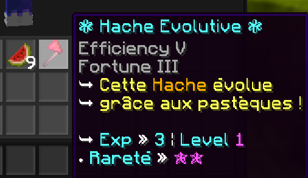

# Evolutive-Axe 🧪

[](https://symfony.com/)


A minecraft plugin customizable.

You can create 6 axe levels, from 0 to 5 and define these data :

- Display Name

- Lore

- Enchantments

- Enchantments levels

- Experience needed to level up

For each melon block break, the axe gain experience and can evoluate.


### Roadmap 📚

In the next months,I'll try to add some features.

- More levels and an automatic detections of the numbers

- Some effects, like the possibility to gain speed, haste, ...

- Change the blocks which give experience

- (if you have some idea... Ayato__#0069 on discord)


## Screenshots 🔍




## How to use it ✨

Clone the project

```bash
  git clone https://github.com/Ayatooo/Evolutive-Axe
```

Go to the project directory : evolutive-axe/target and take the .jar.

Or you can also download the repository in .rar and extract it.

After that, put the jar plugin inside your plugins directory of your minecraft server and run it.


